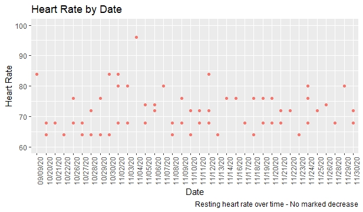
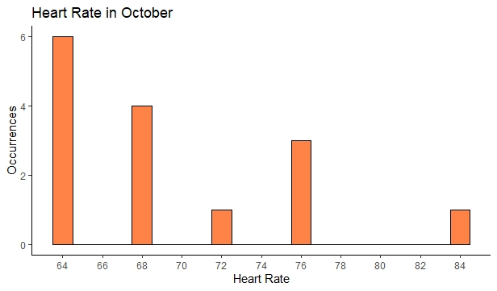
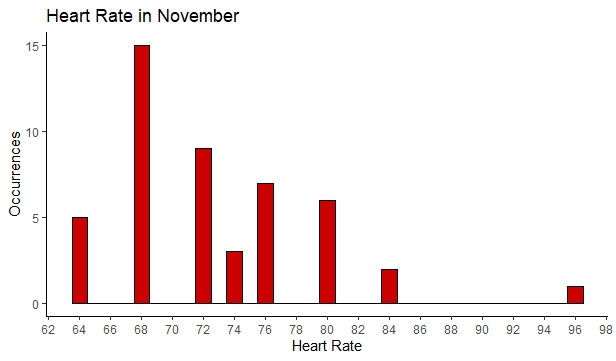
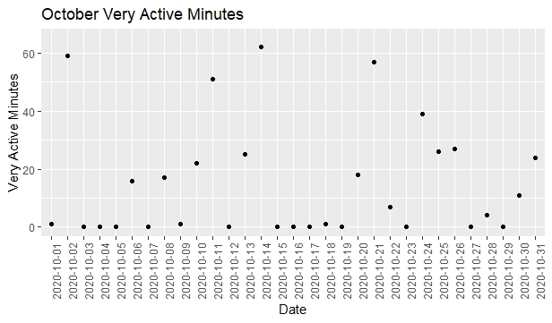
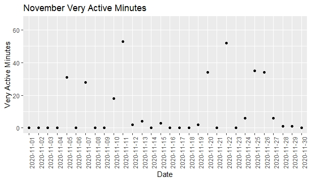
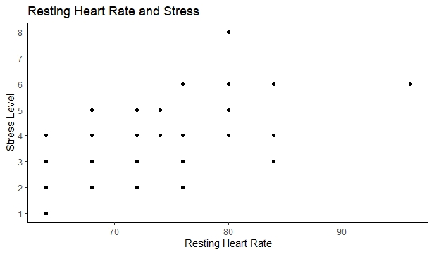
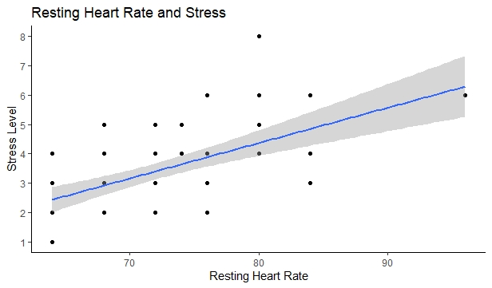
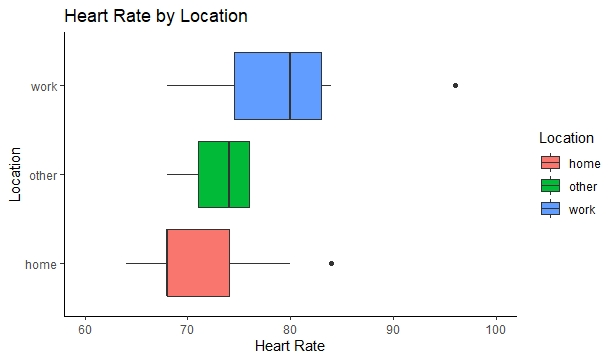
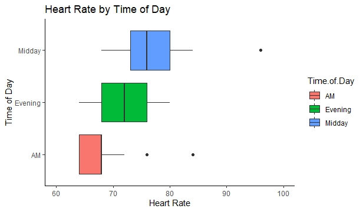

# DAT 203 - Data Visualization Final Project
Kayla Bracall
Fall 2020

## Proposal 
I set out to determine if I could lower my resting heart rate by increasing my cardiovascular exercise from zero times per week to three times per week. I first measured my resting heart rate at 84 beats per minute (bpm). I then began to track my resting heart rate over time, as well as tracking my exercise. 

## Methodology / Data Gathering 
*Heart Rate* 
To track my heart rate, I tried to measure my heart rate three times a day, in the morning right when I woke up, in the midday around lunchtime, and in the evening around dinner or a little later. I also noted where I was during the measurement (home, work, or other) and tracked my stress level. My stress level was self assessed on a scale of 1-10.

*Exercise* 
To track my exercise, I kept a spreadsheet of when I engaged in cardiovascular exercise. I noted the date, the duration of the exercise, and the type of exercise. I also wear a fitbit that tracks my daily step count and activity levels. 

## Conclusions
After all data was collected, I am not able to conclude that I was able to lower my resting heart rate by increasing my cardiovascular exercise from zero times a week to three times a week. I believe I may have needed to invest more time in the endeavor to see a marked decrease. Additionally, as work and school obligations increased throughout the semester, there were a few weeks where I only engaged in cardiovascular exercise two times a week, as opposed to three. 

Below we can see that resting heart rate remains relatively consistent over time. 

 

I also broke down the data by month and looked at October data vs November data. 

*October*

My average resting heart rate in October was 69.333 bpm while the most common value was 64 bpm. My average stress level in October was 3.133. A histogram of October resting heart rate values is below.

 

*November*

My average resting heart rate in November was 72.65 bpm and the most heart rate in November was 68 bpm. My average stress level in November was 3.5. 

 

Additionally, we can see that my activity decreased from October to November. Fitbit tracks activity in four categories:
- Minutes Sedentary 
- Minutes Lightly Active 
- Minutes Fairly Active 
- Minutes Very Active 

Looking specifically at Minutes Very Active, in October I tracked 468 minutes of "very active" activity. In November, this decreased to 310 minutes. Let's visualize this decrease in activity.

## Alternate Findings
While I was unable to prove a relationship between increased cardiovascular exercise and resting heart rate, I was able to visualize the effect that stress, time of day, and location have on my resting heart rate. 

*Stress*
As alluded to above, my stress seemed to have a weak causal relationship to my resting heart rate. My stress level was higher on average in November, and both my average heart rate and most common heart rate value in November were higher. 

Here is heart rate graphed with stress level. 

 

Let's add a trendline to this. 

 

*Location and Time of Day*

Additionally, I was able to see that my heart rate is higher on average during midday and when I am at work. These findings make sense, as I am typically more active during midday than I am during early morning or evening. Additionally, I am more likely to be stressed while at work than I am when I am at home or in a different location. Below we can see these findings visualized using boxplots. 

 

## Final Thoughts and Future Analysis 
Although I was somewhat disappointed that I was unable to prove my original hypothesis, I do think that the other findings have merit. I was able to show that my resting heart rate is higher during midday compared to other times of day. I also was able too show that my resting heart rate is more elevated when I am work as opposed to other locations. Additionally, I was able to gain some insight into why I was unable to prove my original hypothesis, as my activity decreased over time. 

For future students, I would recommend collecting data that can be influenced over a short period of time. I believe the biggest issue with my project is there was not enough time to make a discernible impact on my health which would result in a measurable difference in resting heart rate. 

This project has led to more insight on my stress levels by location and throughout the day. I can use this data to help plan stress management strategies in my life. Additionally, I can extend my project and continue data collection to see if I can influence my resting heart rate through cardiovascular exercise. 

