# Pivot Table Notes
### Kayla Bracall
### October 12, 2020
______________

## Inquiry 1

What patterns exist in the gender of the respondent and their perception of Hazelwood's physical appearance? Are folks more likely to be willing to volunteer for a block watch if they believe the neighborhood's appearance is positive?

A higher percentage of female respondents than male respondents rated the neighborhood "Good." A higher percentage of male respondents than male respondents rated the neighborhood "Poor."

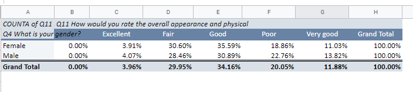 

For respondents that rated the neighborhood appearance "Excellent" 68.75% would participate in a block watch group. However, the second most likely group to participate in a block watch group were those that rated the neighborhood appearance "Poor."
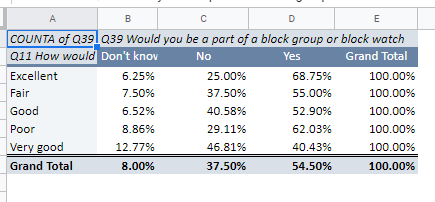

## Inquiry 2
Which subgroup of respondents (sliced on relevant/interesting questions) are most likely to have indiciated interest in a block watch?

## Inquiry 3

Inquire into patterns that exist in respondents ideas for changes to make in Hazelwood (Q6). Would creating sub-planning groups for neighborhood improvements based on age and gender makse sense to you based on the data? Is there a connection between the improvements folks would like to see and the Creative activities folks are interested in (Q29)?

Female respondents are more likely have suggest changes for the community.
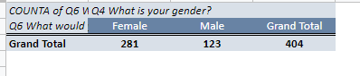

Residents in age group 55-64 submitted the most responses for suggested changes. Generally, those that could be considered middle aged through older (ages 35-74) had the most suggestions for changes. 
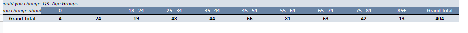

Female respondents are also more likely to be interested in activities.

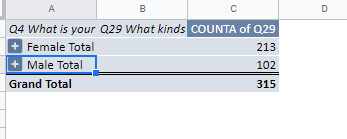

Respondents in the age group 55-64 had the highest response rate to the question "What kind of activities are you interested in?"

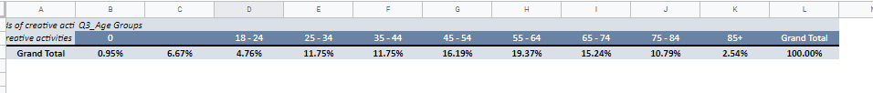

It would be beneficial to create sub-planning group comprised of women aged 55-64.

## Inquiry 4
To what degree are folks who indicate that they have special skills more likely to be willing to volunteer in the community (Q25)?

There were a lot of skills represented in the dataset, so I decided to look at the responses of those who reported no skills. 

About 37.3% of respondents indicated in some way that they did not possess special skills. 

Of this 37.3%, they accounted for 45% of the "Don't Know" responses, 32.75% of the "No" responses, and 24.88% of the "Yes" responses to the question "Would you be willing to dedicate 2 hours a month to volunteer?"

It appears those that do not consider themselves in posession of special skills seem more likely to either be unwilling to or unsure if they will volunteer.

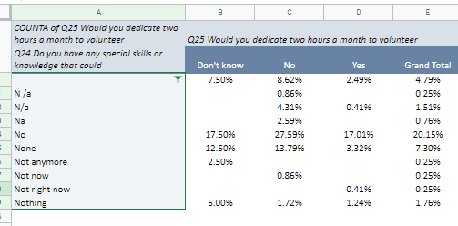

## Inquiry 5
"People who live in larger households (more people) tend to be happier" says the policy maker in Hazelwood. What can the survey data bring to bear on this assertion? What weaknesses exist in the data limiting their ability to contribute insight to this question?

I was unable to pull data into a pivot table for this inquiry.

## Inquiry 6
A town council member suggests that people who own their own home are more "community minded" than those who rent. A recently elected council person disagrees and claims that folks who rent their home are more likely to work lower wage jobs, allowing less time for community engagement. Can the survey data shed insight into this division of thought?

Homeownership has no impact on whether the respondent would be willing to volunteer 2 hours per month. There were no major differences in responses from renters and owners. 

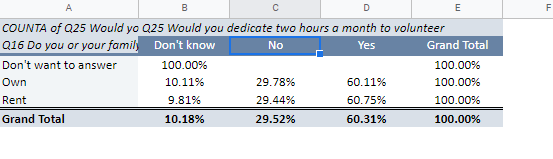 

Similarly, there is no major difference between renters and owners who actually volunteer their time.

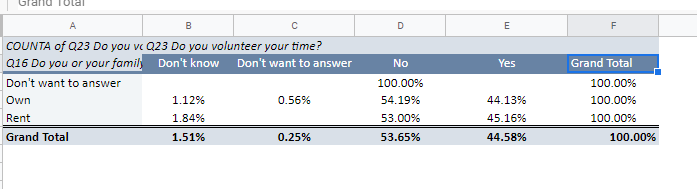 

## Bonus Inquiry

I also decided I wanted to look at my own inquiry. I sliced the question "All things considered, how satisfied would you say you are with life in the neighborhood these days?" by gender. My theory was that female respondents may respond more favorably and give higher scores. The question was answered using a 0-10 scale. 

I looked at the scores both grand total (i.e. of the respondents that answered, how many scored the neighborhood a 10, etc.) and by gender (i.e. of the males that responded, how many scored the neighborhood a 10). 

As expected, female respondents generally rated the neighborhood slightly more favorably.

- Of the total respondents, 19.78% of female respondents rated the neighborhood a 10, per the below graphic. Only 8.21% of male respondents rated the neighborhood a 10.

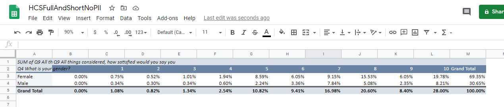 

However, we need to keep in mind that over 69% of the respondents were female. We can look further into responses by breaking down response by gender. 

-28.53% of female respondents rated the neighborhood a 10, as compared to 26.8% of male respondents
- For female respondents, the most common rating was a 10, with 8 being the second most common
- For male respondents, the most common rating was a 10, with 7 being the second most common 

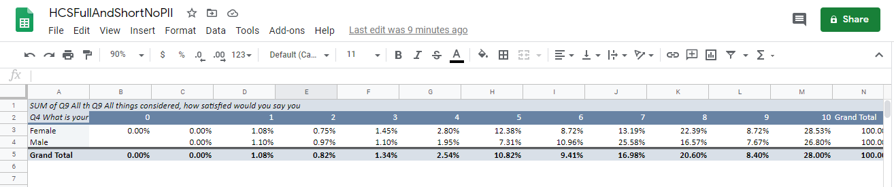 